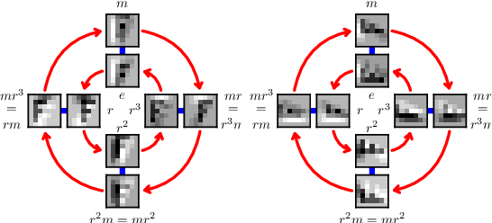

# DeepLearningProject
This is the repository that contains the project of the Deep Learning and Applied Artificial Intelligence 2021/2022 course of Sapienza University of Rome.
For this project I tested the <b>group equivariant convolutional network</b> on the MNIST and CIFAR10 datasets.

In this reposotory there are three notebooks and also the trained model for each dataset:
- for the MNIST dataset I deployed a single notebook for training and test since Colab allows to do the both phases
- for the CIFAR10 there are two notebooks, because I decided to do the training using Kaggle since allows to use a more speed GPU and the test phase with Colab
